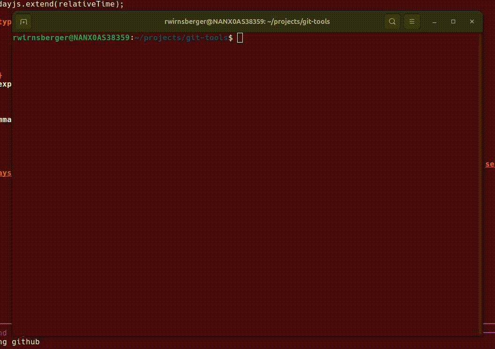
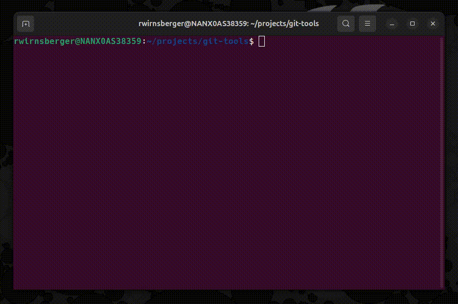
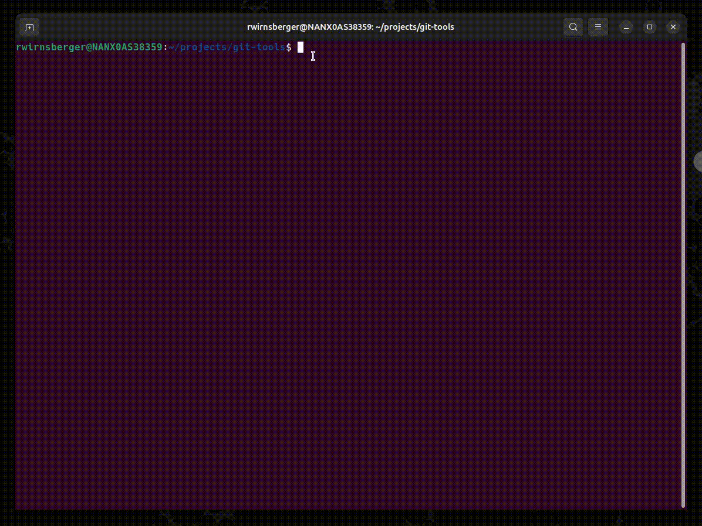

# Installation

Install the CLI globally:
```bash
npm install -g git-tools
```

---

# Prerequisites

- **Node.js** >= 22
- **Git** >= 2.30
- Active internet connection
- **Groq API key** (can be generated for free [here](https://console.groq.com/keys)

---

# Commands

## auto-commit

Generate clean, conventional Git commit messages automatically from your staged changes — with an interactive feedback loop when you want fine-tuning.


---

## auto-branch

Generate a Git branch with an automatically generated name based on the given issue. 


Currently, the following issue providers are supported:
- GitHub
- GitLab
- Jira (Personal Access Token & API Token)

The tool prompts you at the first startup for your credentials. Make sure to grant the required scopes.

---

## branch-cleanup

Analyzes your local branches and tries to find branches which are obsolete.


This is done by checking the merge status, last commit date and the remote tracking status. The tool will not delete any branches without your confirmation.

---

## Configuration (Global vs. Repository)
For the commands `auto-commit` and `auto-branch`, you can configure the tool to use your preferred output style. There is one global configuration file which is shared across all repositories, but this can be overwritten per repository.

To locate or edit the config, run this inside a repository:
```bash
git-tools auto-commit config

# or
git-tools auto-branch config
```

### Recommended setup

#### Global config:
- Groq API key
- issue provider credentials
- Your default instructions & examples

#### Repository config:
- overrides for special commit conventions
- repository-specific examples or wording rules

This keeps sensitive data and defaults in one place, while allowing fine-grained control per project.
